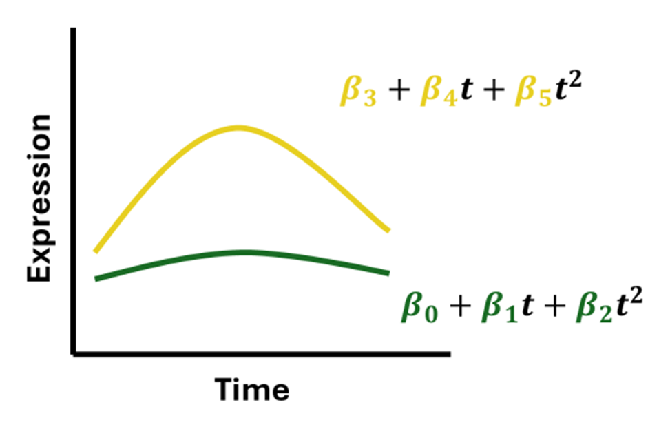
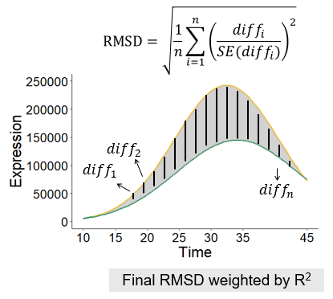
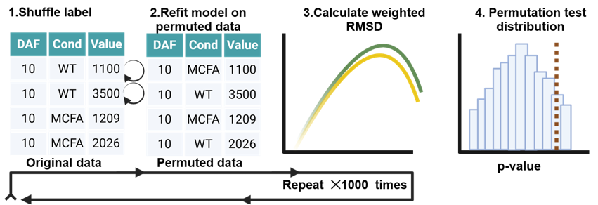
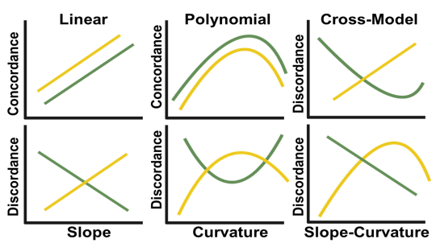

# ShinyGLM

ShinyGLM is an R/Shiny application for exploring temporal omics data using a quadratic generalized linear modeling workflow. The app provides a graphical interface for data upload, quality control, preprocessing, visualization, model fitting, feature ranking, trajectory classification, and result export.

## Main features

- Upload temporal omics data in `.csv` or `.xlsx` format
- Check input data format through a guided QC wizard
- Remove unused columns and optionally filter features with excessive missing values or zeros
- Apply optional preprocessing steps:
  - sample-wise normalization
  - log transformation
  - missing-value imputation
  - feature-wise normalization
- Visualize data before and after preprocessing using:
  - missingness heatmaps
  - sample boxplots
  - PCA plots
  - hierarchical clustering
  - heatmaps
  - barplots
  - boxplots
  - line graphs
- Fit a quadratic temporal model for each feature
- Rank features by weighted RMSD
- Estimate empirical p-values by permutation testing
- Classify feature trajectories into predefined trajectory categories
- Export processed data and full model results

## Installation

You can install the development version from GitHub:

```r
# install.packages("devtools")
devtools::install_github("AllenLab-DDPSC/ShinyGLM")
```

## Run the app

After installation, start the app with:

```r
library(ShinyGLM)
run_app()
```

Alternatively, during development, open the package project and run:

```r
devtools::load_all()
run_app()
```

## Input data format

The input data should be a `.csv` or `.xlsx` file.

The data must contain one `ID` column and measurement columns named using the following format:

```text
Condition_Time_Replicate
```

For example:

```text
WT_10_R1
WT_10_R2
Mutant_10_R1
Mutant_10_R2
```

The expected columns are:

- `ID`: a unique feature identifier, such as a gene, protein, metabolite, or other omics feature
- `Condition`: treatment, genotype, or experimental condition
- `Time`: numeric time point; all time points should use the same unit
- `Replicate`: replicate identifier

The app currently expects:

- exactly two conditions
- at least three time points
- numeric measurement values

Additional non-measurement columns are removed during the data preparation workflow.

## Workflow

### 1. Data upload and QC

Upload a `.csv` or `.xlsx` file in the **Import Data** tab. The app checks whether the required `ID` column is present, whether IDs are unique, whether measurement columns follow the expected naming format, whether there are two conditions, and whether time points are numeric.

### 2. Filtering and preprocessing

The app can identify features with excessive zeros or missing values. Users can choose whether to remove these features. Optional preprocessing steps include sample normalization, log transformation, missing-value imputation, and feature normalization.

After preprocessing, the app provides summary plots comparing the data before and after processing. The processed data can also be downloaded.

### 3. Data visualization

Before model fitting, users can visualize selected features and datasets using heatmaps, barplots, boxplots, and line graphs. These plots can be generated from either the original data or the processed data.

### 4. Model fitting

For each feature, ShinyGLM fits a quadratic model of the form:

$$
y = \beta_0 + \beta_1 I + \beta_2 t + \beta_3 It + \beta_4 t^2 + \beta_5 It^2 + error
$$

where `I` is the condition indicator, with `0` representing the reference condition and `1` representing the second condition. Interaction terms allow the two conditions to differ in trajectory over time.

The app can optionally center time before model fitting.



### 5. Feature ranking

For each feature, the fitted model is used to generate predicted values across a dense grid of time points. The difference between conditions is summarized using RMSD, and the RMSD is weighted by the model adjusted R-squared value:

```text
weighted RMSD = RMSD x adjusted R-squared
```

Features with larger weighted RMSD values show greater modeled trajectory divergence between conditions.



### 6. Permutation testing

Permutation testing is used to estimate empirical p-values for weighted RMSD. The condition labels are permuted within time points to preserve the temporal structure of the data while generating a null distribution of trajectory differences.

False discovery rate values are calculated from the empirical p-values.



### 7. Trajectory classification

Features are classified into five trajectory categories:

1. Linear Concordance
2. Linear Discordance
3. Polynomial Concordance
4. Polynomial Discordance
5. Cross-Model Discordance

These categories summarize whether the two conditions show similar or opposing linear or polynomial temporal trends.



## Output

The app provides:

- downloadable processed data file
- downloadable full model result file
- 3D coefficient plot
- trajectory classification pie chart
- volcano plot

The model result file includes feature ranking, empirical p-values, FDR values, trajectory classification, weighted RMSD, adjusted R-squared, and fitted coefficients for each condition.

## Development status

This package is under active development. The current version is intended for research use and exploratory analysis of temporal omics datasets.

## Citation

If you use this tool in published work, please cite the associated manuscript or repository when available.
